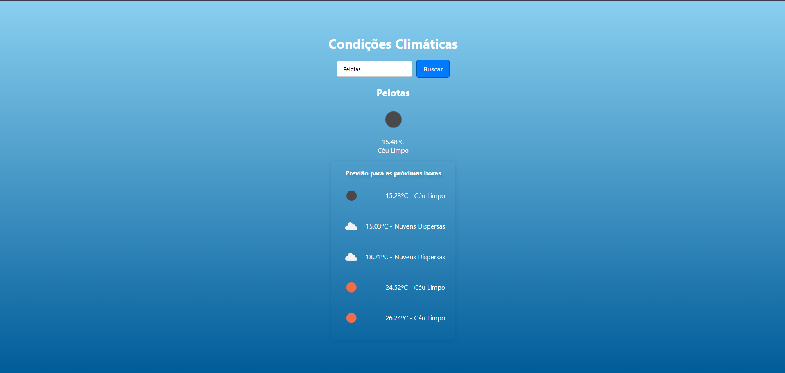

# Weather App

A Weather App built with React and TypeScript that fetches weather data using the OpenWeather API. The app allows users to search for weather conditions by city and view the current weather as well as a forecast.

## Built With

- [OpenWeather](https://openweathermap.org/) - Weather API

## Features

- Search for weather by city
- Display current weather conditions
- Show forecast for the next hours
- Responsive design

## Screenshots



## Getting Started

### Prerequisites

Make sure you have the following installed:

- Node.js
- npm or yarn

### Installation

1. Clone the repository:

   ```bash
   git clone https://github.com/xmurilo/weather.git
   cd weather
   ```

2. Install dependencies:

   ```bash
   npm install
   # or
   yarn install
   ```

3. Create a `.env` file in the root of the project and add your OpenWeather API key:

   ```env
   VITE_API_KEY=your_openweather_api_key
   ```

### Running the App

To start the development server, run:

```bash
npm run dev
# or
yarn dev
```

Open [http://localhost:5173/](http://localhost:5173/) to view it in the browser.

## Project Structure

- `src/` - Source code
  - `components/` - React components
  - `styles/` - Styled-components styles
  - `types/` - TypeScript type definitions
  - `utils/` - Utility functions
  - `App.tsx` - Main app component
  - `index.tsx` - Entry point

## Usage

1. Enter the name of a city in the search bar.
2. Click on the "Get Weather" button.
3. View the current weather and forecast.
